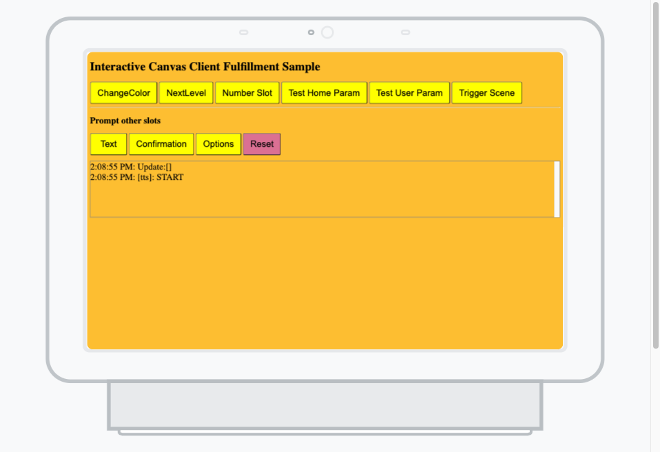

# Actions on Google: Interactive Canvas with Angular Sample

This is an [Interactive Canvas sample](https://developers.google.com/assistant/interactivecanvas)
which shows how to use Client Fulfillment to improve the performance
of your game between conversational turns.

This Action benefits from a visually rich experience that allows you to
provide interactive content combined with an intuitive conversational flow for
users where [existing visual components](https://developers.google.com/assistant/conversational/prompts-rich)
are not sufficient.

### Prerequisites
1. Node.js and NPM
    + We recommend installing using [nvm for Linux/Mac](https://github.com/creationix/nvm) and [nvm-windows for Windows](https://github.com/coreybutler/nvm-windows)
1. Install the [Firebase CLI](https://developers.google.com/assistant/actions/dialogflow/deploy-fulfillment)
    + We recommend using MAJOR version `8` , `npm install -g firebase-tools@^8.0.0`
    + Run `firebase login` with your Google account

### Setup
#### Actions Console
1. From the [Actions on Google Console](https://console.actions.google.com/), **New project** > **Create project** > under **What kind of Action do you want to build?** > **Game** > **Blank project for smart display**
    + Take note of the project ID, as this will be used later in the setup.

#### Firebase Hosting Deployment
1. Run `npm install` to install dependencies
1. Run `npm run build` to generate a build of the web app
1. Run `firebase deploy --project {PROJECT_ID} --only hosting` to deploy the web app to Firebase Hosting
   + To find your Project ID: In the Actions Console console for your project, navigate to ⋮ > Project settings > Project ID.

#### Actions CLI
1. Install the [Actions CLI](https://developers.google.com/assistant/actionssdk/gactions)
1. Navigate to `sdk/settings/settings.yaml`, and replace `<PROJECT_ID>` with your project ID
1. Navigate to `sdk/custom/global/actions.intent.MAIN.yaml`, and replace `<PROJECT_ID>` with your project ID
1. Navigate to `sdk/custom/global/change_color.yaml`, and replace `<PROJECT_ID>` with your project ID
1. Navigate to `sdk/custom/global/next_level.yaml`, and replace `<PROJECT_ID>` with your project ID
1. Navigate to `sdk/scenes/BaseEmptyScene.yaml`, and replace `<PROJECT_ID>` with your project ID
1. Navigate to `sdk/scenes/TargetScene.yaml`, and replace `<PROJECT_ID>` with your project ID
1. Run `gactions login` to login to your account.
1. Run `gactions push` to push your project.
1. Run `gactions deploy preview` to deploy your project.

### Running this Sample
+ You can test your Action on any Google Assistant-enabled device on which the Assistant is signed into the same account used to create this project. Just say or type, “OK Google, talk to my test app”.
+ You can also use the Actions on Google Console simulator to test most features and preview on-device behavior.

#### Using this Sample

+ Use the buttons on the screen to initialize a specific action, and then use your voice to complete the action.
  + For example, press the button "Change Color".
  + Next, give a voice command "Change color to red".
  + The intent is handled locally, without the need for a webhook.

## References & Issues
+ Questions? Go to [StackOverflow](https://stackoverflow.com/questions/tagged/actions-on-google) or the [Assistant Developer Community on Reddit](https://www.reddit.com/r/GoogleAssistantDev/).
+ For bugs, please report an issue on Github.
+ Actions on Google [Documentation](https://developers.google.com/assistant)
+ Actions on Google [Codelabs](https://codelabs.developers.google.com/?cat=Assistant)

## Contributing
Please read and follow the steps in the [CONTRIBUTING.md](CONTRIBUTING.md).

## License
See [LICENSE](LICENSE).